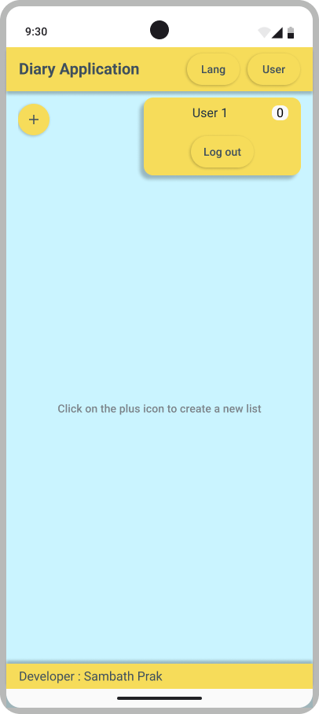
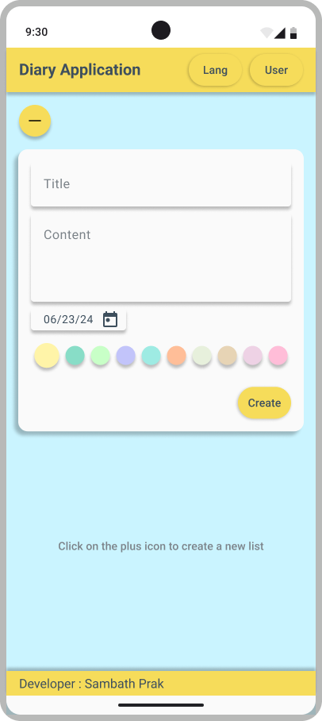

# Diary-Application

## Project Information

Repository : [Gitlab](https://git.clp.kr/anbschool/2nd/luck/prak-sambath/diary-application.git) [Github](https://github.com/PrakSambath/diary-application.git)<br/>
Owner : Sambath PRAK <br/>
Server hosting: GitHub <br/>
Deployment website : [Diary Application](https://praksambath.github.io/diary-application/)

## Description

Welcome to Diary Application! My name is PRAK Sambath (ប្រាក់ សម្បត្តិ) as in Khmer, I create this application allows users to create and manage personal journal entries using HTML, CSS, and JavaScript. Whether you want to record your thoughts, memories, or daily experiences, Diary Application has you covered.

## Visuals

Login page


User info



Create new entry



## Features
  - CRUD Operations:
    - **Create**: Add new entries by clicking “Create.”
    - **Read**: View existing entries in the list.
    - **Update**: Edit an entry by clicking the “Edit” button.
    - **Delete**: Remove an entry using the “Delete” option.
  - Security and Privacy:
    - Your entries are stored locally on your device.
    - No data is sent to external servers.
  - Language support:
    - English and Khmer.

## Usage

  - Creating a New Entry:**
    - Click the “+” button.
      - Write your thoughts in the text area.
      - Select the date in your memories.
      - Choose a stuning color represent your feeling.
      - Click “Create” button to make it alive.
  - Read (Retrieve) an Entry:
      - Display a list of existing entries.
      - Allow users to view its details.
  - Update an Entry:
      - Provide an “Edit” button next to each entry.
      - When clicked, open a form with pre-filled data from the selected entry.
      - Allow users to modify the content and save the changes.
  - Delete an Entry:
      - Include a “Delete” button next to each entry.
        When clicked, the entry will delele immediately, please be careful.


## Installation

  1. Clone the Repository:
      - Open your terminal or command prompt.
      - Navigate to the directory where you want to     clone the repository.
      - Run the following command to clone the repository

        ```shell
        git clone https://github.com/PrakSambath/diary-application.git
        cd diary-application
        ```
  2. Running the Application:

      Open the `index.html` file in your web browser.   
      **Development Server Recommendation**: For a more convenient development experience, consider using a local development server like Live Server. This will automatically refresh the browser whenever you make changes to the code. Installation instructions for Live Server can be found on their website.

**Alternatively**: Download the source code as a ZIP file directly from the repository.


## UI/UX

[IA](https://miro.com/app/board/uXjVK1GoKLk=/?share_link_id=460713333841)

[UI Screen](https://www.figma.com/design/zCGRccFoLSuCdaHyviuv6u/DiaryWebApp?node-id=5-5&t=Rq83O3RZvKuKPrtj-1)

[Flow Guide](https://miro.com/app/board/uXjVK5dvQqw=/?share_link_id=943964739727)

## Convention guide

I offer a convention guide to help you better understand code structure. To visit the convention guide page, click this [link](./assets/docs/convention-guide.md).

## Programming Languages

- HTML
- CSS
- JavaScript

## Support

Feel free to contact me if you have any questions or need help 😊.    
Facebook: https://www.facebook.com/sambathprak789/    
Email: sambathprak789@gmail.com

## Contributing

Contributions are welcome! If you’d like to improve the app or fix any issues, feel free to submit a pull request.


## License

This project is licensed under the MIT License.
